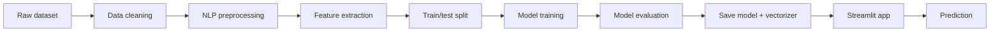

# AI Spam Shield

AI Spam Shield is a production-style email and SMS spam detection application built with Python, NLP, and machine learning. The project follows a complete pipeline from dataset loading to model evaluation and deployment-ready Streamlit UI.

## Overview

The application analyzes incoming text messages and classifies them as spam or ham using a trained machine learning model. It uses supervised learning on labeled SMS/email examples and saves the trained model so the app can run quickly without retraining every time.

## Features

- Clean and modular ML pipeline
- NLP preprocessing with lowercase normalization, punctuation removal, tokenization, stop-word removal, and stemming
- Feature extraction using CountVectorizer and TF-IDF Vectorizer
- Training and comparison of multiple models
- Accuracy, precision, recall, F1-score, and confusion matrix evaluation
- Model persistence with joblib
- Responsive dark glassmorphism Streamlit interface
- Session-based prediction history
- Friendly error handling and security-focused usage guidance

## Architecture



## Technology Stack

- Python 3
- Pandas
- NumPy
- NLTK
- scikit-learn
- Matplotlib
- Seaborn
- WordCloud
- Joblib
- Streamlit

## Machine Learning Pipeline

1. Load the dataset with flexible column detection.
2. Clean missing values and duplicate entries.
3. Standardize labels to spam/ham.
4. Preprocess message text.
5. Split into training and test sets with stratification.
6. Fit vectorizer on training data only.
7. Train several models and compare them.
8. Save the best-performing model and vectorizer.
9. Load saved pipeline in the app for prediction.

## NLP Pipeline

The text is cleaned and normalized through these steps:

- Lowercase conversion
- URL and email removal
- Removal of punctuation and non-alphanumeric characters
- Tokenization
- Stop-word removal
- Stemming
- Extra whitespace cleanup

This ensures that the same preprocessing is applied during model training and during live prediction.

## Model Comparison

The project compares the following algorithms:

- Multinomial Naive Bayes
- Logistic Regression
- Random Forest
- AdaBoost
- Gradient Boosting
- XGBoost if installed

The final model is selected using F1-score and accuracy as the primary criteria while also considering precision and recall.

## Project Structure

```text
Email-spam/
├── app.py
├── README.md
├── requirements.txt
├── .gitignore
├── data/
│   └── spam.csv
├── models/
│   ├── metadata.json
│   ├── model_comparison.json
│   ├── spam_model.pkl
│   └── vectorizer.pkl
├── notebooks/
│   └── model_training.ipynb
├── src/
│   ├── __init__.py
│   ├── evaluate.py
│   ├── predict.py
│   ├── preprocessing.py
│   └── train.py
├── assets/
│   └── images/
└── .git/
```

## Local Installation

```bash
python -m venv .venv
source .venv/bin/activate
pip install -r requirements.txt
python -m nltk.downloader punkt stopwords
```

## Running the Application

```bash
streamlit run app.py
```

## Training the Model

```bash
python src/train.py
```

The script loads the dataset from the `data` folder, trains multiple models, compares them, and saves the best variant in the `models` directory.

## Deployment

This project is designed to work on free-tier hosting, especially Streamlit Community Cloud.

Steps:

1. Push the repository to GitHub.
2. Connect the repository to Streamlit Community Cloud.
3. Use Python 3.10+ environment.
4. Install dependencies from `requirements.txt`.
5. Set the app entry to `app.py`.
6. Deploy.

## Screenshots

Add screenshots here after running the app locally.

## Future Improvements

- Add an email attachment scanner
- Combine text and metadata features
- Add user feedback to improve the model over time
- Support multilingual spam detection
- Add model versioning and A/B tests

## Limitations

- The model is only as good as the training data.
- Spam patterns evolve constantly, so periodic retraining is recommended.
- A single message may be uncertain, so model confidence should be interpreted as a risk signal rather than certainty.

## Why Accuracy Is Not Enough

A spam classifier should not be judged by accuracy alone. In cybersecurity, false positives matter. A legitimate message incorrectly flagged as spam can block important communication. Precision and recall are therefore essential measures when evaluating spam models.

## License

This project is intended for educational and portfolio use.
